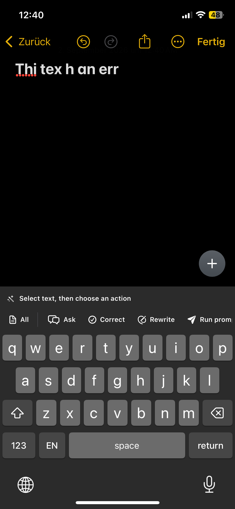
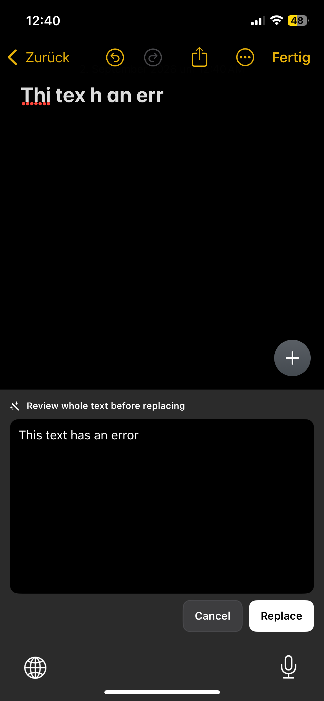
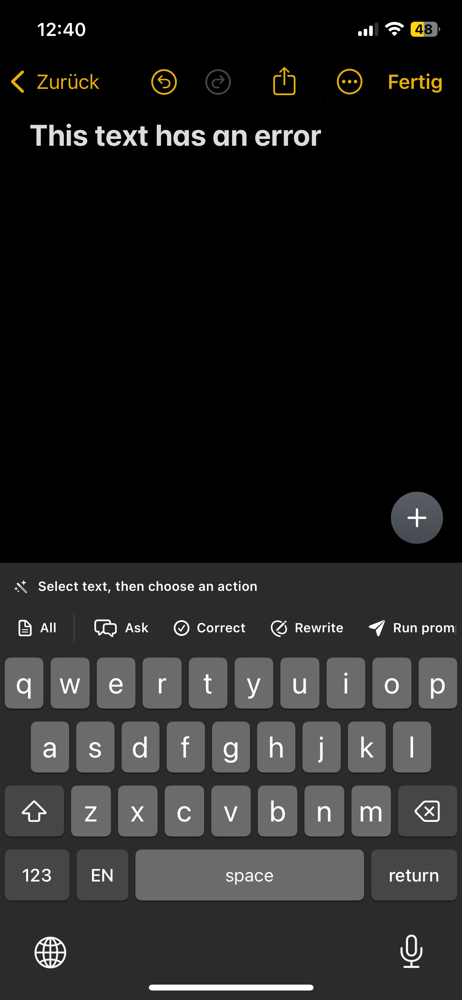
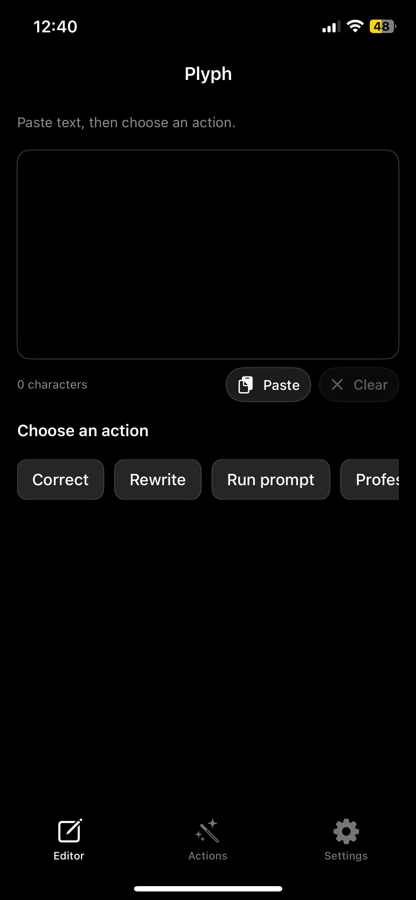
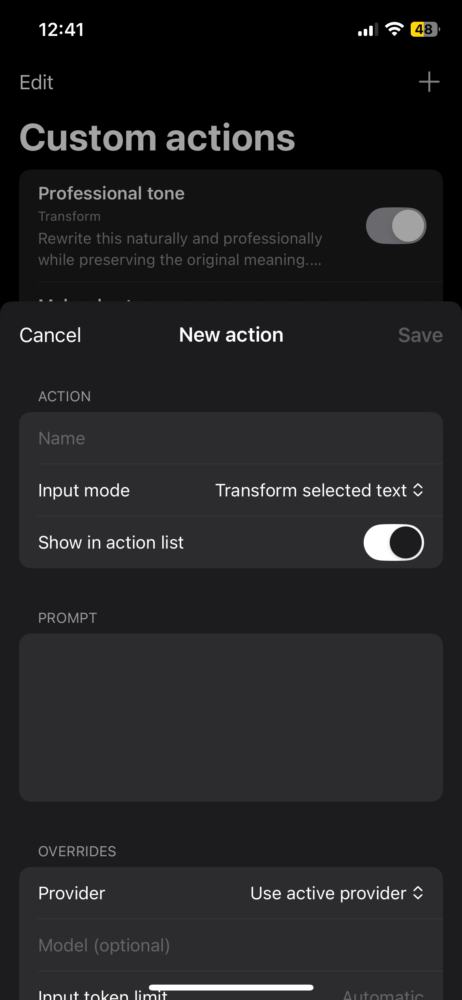
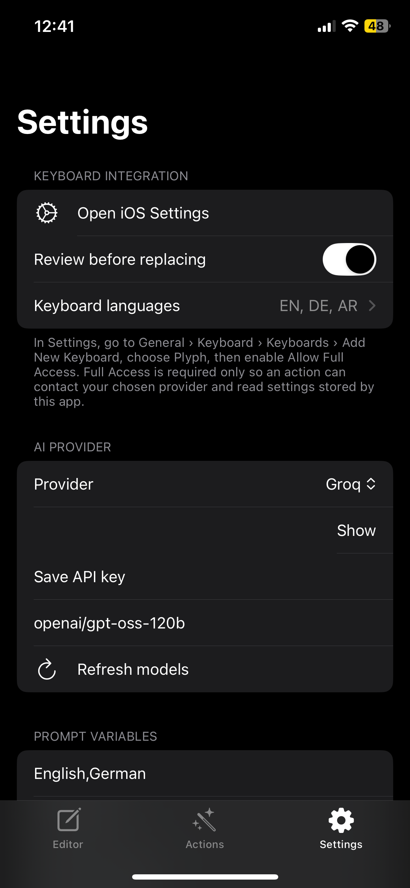

<p align="center">
  
</p>

<h1 align="center">Plyph for iOS</h1>

<p align="center">
  AI text actions from a native iOS app and custom keyboard.
  <br>
  Correct, rewrite, ask questions, or run custom prompts using the provider you choose.
</p>

<p align="center">
  
  
  
  
</p>

<p align="center">
  <a href="#screenshots">Screenshots</a> ·
  <a href="#features">Features</a> ·
  <a href="#getting-started">Getting started</a> ·
  <a href="#github-actions-build">Download</a> ·
  <a href="#build-from-source">Build</a> ·
  <a href="#privacy">Privacy</a>
</p>

---

## Screenshots

<table>
  <tr>
    <td></td>
    <td></td>
  </tr>
  <tr>
    <td align="center">Keyboard actions</td>
    <td align="center">Review before replacing</td>
  </tr>
  <tr>
    <td></td>
    <td></td>
  </tr>
  <tr>
    <td align="center">Custom keyboard</td>
    <td align="center">Editor</td>
  </tr>
  <tr>
    <td></td>
    <td></td>
  </tr>
  <tr>
    <td align="center">Custom actions</td>
    <td align="center">Settings</td>
  </tr>
</table>

## How Plyph works

Configure a provider in the app, enable the Plyph keyboard, and select text in any editable field. Plyph can correct or rewrite the selection, answer a question about it, or run one of your custom actions. You can review the result before replacing the original text.

## Features

- **Keyboard actions** — correct, rewrite, ask questions, or run a prompt without leaving the current app.
- **Review before replacing** — inspect generated text before it changes the original selection.
- **Custom actions** — create reusable prompts with their own provider, model, input mode, and token limits.
- **Selection controls** — work with selected text or the text surrounding the cursor.
- **Cursor movement** — drag across the space bar to reposition the cursor.
- **Multiple layouts** — English, German, Arabic, French, Spanish, Italian, Portuguese, Dutch, Turkish, and Russian.
- **Provider choice** — Ollama, OpenAI, OpenRouter, Gemini, Groq, Cerebras, and Vercel AI Gateway.
- **Private credentials** — API keys are stored in the shared iOS Keychain.

## Getting started

1. Open Plyph and configure a provider, API key, and model.
2. Open **Settings > General > Keyboard > Keyboards > Add New Keyboard**.
3. Select **Plyph**.
4. Open the Plyph keyboard entry and enable **Allow Full Access**.
5. Select text in an editable field, switch to Plyph, and choose an action.

Some apps do not expose selected text to third-party keyboards. Copy the text first and use **Ask** when selection access is unavailable.

## Requirements

- iOS 18 or newer
- Xcode 16 or newer when building from source
- [XcodeGen](https://github.com/yonaskolb/XcodeGen)
- A configured provider or reachable local Ollama server

## GitHub Actions build

The `Build Plyph iOS IPA` workflow creates an ad-hoc-signed IPA that SideStore or AltStore can re-sign with your Apple ID.

1. Open the repository's **Actions** tab.
2. Select **Build Plyph iOS IPA**.
3. Choose **Run workflow** and wait for the build to finish.
4. Download the **Plyph-iOS** artifact from the completed run.
5. Extract the artifact to get `Plyph.ipa` and `Plyph.ipa.sha256`.

The checksum can be verified on macOS with:

```sh
shasum -a 256 -c Plyph.ipa.sha256
```

### Install with SideStore

1. In SideStore, enable **Use Main App's Provisioning Profile for App Extensions**. This is recommended because Plyph and its keyboard extension then use one App ID.
2. Import `Plyph.ipa` and keep the keyboard extension when SideStore signs the app.
3. Refresh Plyph through SideStore before the development profile expires.

### Install with AltStore

1. Open **My Apps**, tap **+**, and select `Plyph.ipa`.
2. Keep the app extension when AltStore asks. Removing it also removes the Plyph keyboard.
3. AltStore normally registers a separate App ID for the keyboard extension, so make sure an App ID slot is available.
4. Refresh Plyph through AltStore before the development profile expires.

After installation, open Plyph once and then follow the keyboard setup steps under [Getting started](#getting-started).

## Build from source

Clone the repository and generate the Xcode project:

```sh
git clone https://github.com/ubaimutl/Plyph-IOS.git
cd Plyph-IOS
brew install xcodegen
xcodegen generate
open Plyph.xcodeproj
```

Choose the `Plyph` scheme and run it on an iPhone or iPad. The app and keyboard extension use an App Group and shared Keychain access group, so your signing team must support both entitlements.

To create an unsigned IPA for sideloading:

```sh
./scripts/build-ipa.sh
```

The resulting file is written to `build/Plyph.ipa`.

## Privacy

Plyph has no account system, analytics, telemetry, accessibility service, or background clipboard monitoring. API keys are stored in the iOS Keychain. Text is sent only when you choose an action, directly to the configured provider.

The keyboard requires **Allow Full Access** for network requests and access to settings shared with the main app. A local Ollama server must be reachable from the iPhone; `127.0.0.1` refers to the iPhone itself.

## License

Plyph is source-available under the [PolyForm Shield License 1.0.0](LICENSE).

You may view, modify, use, and redistribute the source subject to the license terms, but the software may not be used to provide a product that competes with Plyph or another product provided using Plyph.

Portions of the keyboard implementation were adapted from Dictus iOS and remain available under the Dictus MIT License. See [THIRD_PARTY_NOTICES.md](THIRD_PARTY_NOTICES.md).
